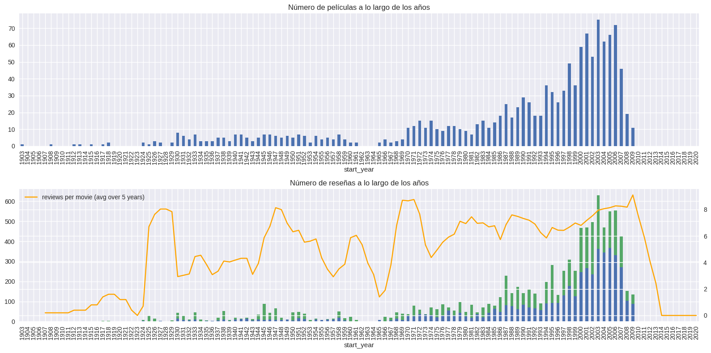

# 🎬 Proyecto 16: Film Junky Union

 
Este proyecto analiza reseñas de películas para clasificar opiniones, identificar tendencias y descubrir patrones en valoraciones de usuarios.

---

## 🚀 Objetivo
Implementar modelos de procesamiento de lenguaje natural (NLP) para analizar reseñas de películas y predecir valoraciones, utilizando técnicas modernas de machine learning.

---

## 🧩 Estructura del Proyecto
- `Proyecto_16.ipynb`: Análisis exploratorio, modelado y resultados
- Archivos CSV/TSV: Datos de reseñas y valoraciones
- Reportes y visualizaciones

---

## 🛠️ Tecnologías y Herramientas
    

---

## 📈 Resultados Destacados
- Identificación de palabras clave y sentimientos en reseñas
- Modelos de clasificación de valoraciones con métricas de precisión y recall
- Reportes claros y visualizaciones interactivas

---

## 🖼️ Visualización

<!-- Aquí puedes agregar imágenes de gráficos o resultados cuando los tengas -->

### Ejemplo de resultado

## ▶️ Cómo ejecutar
1. Clona el repositorio
2. Abre el notebook principal en Jupyter
3. Sigue las instrucciones y explora los resultados

---

## 👤 Autor
**Juan Antonio Álvarez Trinidad**

## 📅 Fecha
**25 de noviembre de 2025**

---

¿Te interesa saber más? ¡Explora los notebooks y descubre cómo los datos pueden transformar la industria del cine!

